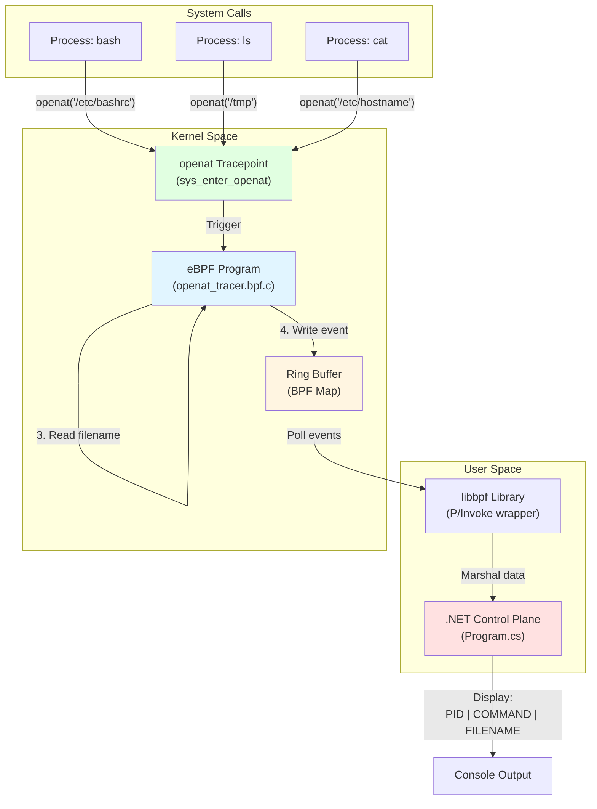

# Architecture Diagram



## Data Flow

1. **System Call**: A process calls `openat()` to open a file
2. **Tracepoint Trigger**: Kernel tracepoint `sys_enter_openat` fires
3. **eBPF Execution**: 
   - eBPF program reads PID from kernel
   - Reads process command name
   - Reads filename argument
   - Creates event structure
4. **Ring Buffer**: Event is written to BPF ring buffer (shared memory)
5. **.NET Poll**: Control plane polls ring buffer for new events
6. **Marshal**: Binary data is marshaled into C# struct
7. **Display**: Event is formatted and printed to console

## Event Structure

```
┌─────────────────────────────────────┐
│     OpenatEvent Structure           │
├─────────────────────────────────────┤
│ pid       (4 bytes)   → 1234        │
│ comm      (16 bytes)  → "bash\0"    │
│ filename  (256 bytes) → "/etc/..."  │
└─────────────────────────────────────┘
```

## Key Technologies

- **eBPF**: Extended Berkeley Packet Filter - runs code in kernel space
- **Tracepoints**: Static kernel instrumentation points
- **Ring Buffer**: Lock-free, per-CPU circular buffer for passing data
- **libbpf**: User-space library for loading and managing eBPF programs
- **P/Invoke**: .NET mechanism for calling native C libraries
